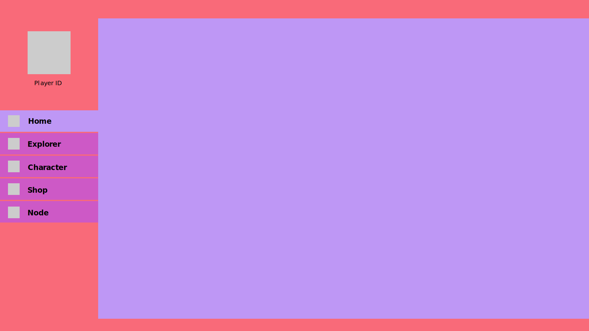

# Grant Application: Kosmic Dashboard

## Project Description
This project will provide a web-based dashboard UI, built on top of the Libplanet blockchain node. The UI consists of multiple modules that will be displayed in a tab-like menu. It will expand the game functionality by bringing in-game features to the web while also helping to push new features not yet developed. 

 

## Motivation
Nine Chronicles is more than just a game. It's a new concept, new technology, but the most exciting part is, it's a new way for freelance or hobbyist developers to work in a fun enjoyable environment, where we can see and experience the changes for a long time to come.

 

## Team Members
Our team currently consists of 2 active members. We are looking to expand our team by recruit more developers as they join the Ecosystem or hiring 1-2.

**Blaque Allen (SoFloppy) - [Team Leader] - sofloppy@cryptokasm.io**
- Project Management
- Intermediated Coding Skills 
- Web Development
- Graphic Design

**Michael Rice (hadesburn) - [Knowledge & Tester] - hadesburn@cryptokasm.io**
- QA/Tester
- Customer User Experience
- Support
- Blockchain Mining/Pool Knowledge
- Windows Desktop/Server Administrator

 

## Team Website
- https://cryptokasm.io/
- https://dashboard.cryptokasm.io

 

## Team Repositories
- Dashboard: https://github.com/CryptoKasm/9c-kosmic-dashboard\
    - Home: https://github.com/CryptoKasm/kosmic-module-home\
    - Explorer: https://github.com/CryptoKasm/kosmic-module-explorer\
    - Character: https://github.com/CryptoKasm/kosmic-module-character\
    - Shop: https://github.com/CryptoKasm/kosmic-module-shop\
    - Node: https://github.com/CryptoKasm/kosmic-module-node\

 

## Project Overview
This project will provide a web-based dashboard UI, built on top of the Libplanet blockchain node. The UI consists of multiple modules that will be displayed in a tab-like menu. It will expand the game functionality by bringing in-game features to the web while also helping to push new features not yet developed. 

**Modules**
- Home 
    - Character Selection
    - Basic Account Overview
        - Character Name
        - Character lvl
        - Character CP
        - AP Meter
        - Prosperity Meter
        - Blacksmithing Meters
        - NCG Amount
    - Public ID (Feature: Quick Copy)
    - Private Key (Kosmic Dashboard will NOT save any private data.) 
        - Local Node: 
            - Location to find & copy Private_Key: Settings > Account
            - Transactions will be handled via GraphQL, directly to local node
        - Remote Node: (Not supported yet) 
            - Requires Wallet
    - Search (Everything: Blockchain, Players, Items, Creatures)
    - News
    - Basic Node Data
- Explorer
    - Search (Blockchain Only)
    - Statistics
    - Visual Graphs
        - Unspecific as of the moment
        - Added because Kijun mentioned: http://jondot.github.io/graphene/
    - Live Blockchain Feed
- Character
    - Live Character Preview
    - Player Stats
    - Player Inventory
    - Personal Ranking Stats
    - Mined Blocks
    - All Transactions
- Shop
    - Graphical Item Database
    - Live Preview of Item on Player
    - P2P Trading (handled through store API, charge tax)
    - Statistics on Trades (Market Fluctuations on items, Personal Trade History)
- Node
    - Miner Settings
    - Live Logging Display: Node logs
    - Download Log File
    - Manually Refresh Snapshot

**Features**
- Documentation
- Responsive: Desktop to Mobile
- Themed as Nine Chronicles (may need assistance from Design Team)
- Animation Effects
- Game Database for instant responses to queries not needing live data
- More - Coming Soon

 

    

 

## Development Roadmap
This project will be executed over 4 months and can commence as soon as the grant application is approved. Documentation will be written and added at the end of each milestone. All projects are licensed as Apache 2. Progress may drastically speed up, as we become more used to the source code and tools used in development. 

 

    

 

### Milestone 1 - Duration: 4 Weeks
- Week 1: Familiarize ourselves with the source-code and GraphQL endpoints
- Week 2: Develop the tools and environment to quickly deploy and test future modules
    - Dockerfile
    - Database
    - Conversion script: Chain to DB
- Week 3: Design [Module: Home]
    - Brainstorm UI layout
    - Design UI in Adobe CC
- Week 4: Code & Testing [Module: Home]
    - Framework: Vue.js - https://vuejs.org/
    - Plugins: Vue Apollo - https://apollo.vuejs.org/
    - CSS Framework: TailwindCSS - https://tailwindcss.com/
- Deliverables for this milestone:
    - Documentation
        - Setting up environment
        - Configure and build [Module:Home] 
    - Source code on GitHub
    - Dockerfile to build image
    - Docker-compose to provide immediate preview using the built image and lightweight webserver

### Milestone 2 - Duration: 4 Weeks
- Week 1: Design [Module: Explorer]
    - Brainstorm UI layout
    - Design UI in Adobe CC
- Week 2: Code, Testing, and Bug Fixes [Module: Explorer]
    - Framework: Vue.js - https://vuejs.org/
    - Plugins: Vue Apollo - https://apollo.vuejs.org/
    - CSS Framework: TailwindCSS - https://tailwindcss.com/
- Week 3: Design [Module: Node]
    - Brainstorm UI layout
    - Design UI in Adobe CC
- Week 4: Code, Testing, and Bug Fixes [Module: Node]
    - Framework: Vue.js - https://vuejs.org/
    - Plugins: Vue Apollo - https://apollo.vuejs.org/
    - CSS Framework: TailwindCSS - https://tailwindcss.com/
- Deliverables for this milestone:
    - Documentation
        - Setting up the environment
        - Configure and build [Module:Explorer]
        - Configure and build [Module:Node] 
    - Source code on GitHub
    - Dockerfile
    - Docker-compose to provide immediate preview using the built image and lightweight webserver
### Milestone 3 - Duration: 4 Weeks
- Week 1: Design [Module: Character]
    - Brainstorm UI layout
    - Design UI in Adobe CC
- Week 2-3: Code [Module: Character]
    - Framework: Vue.js - https://vuejs.org/
    - Plugins: Vue Apollo - https://apollo.vuejs.org/
    - CSS Framework: TailwindCSS - https://tailwindcss.com/
- Week 4: Testing & Bug Fixes
- Deliverables for this milestone:
    - Documentation
        - Setting up the environment
        - Configure and build [Module:Character]
    - Source code on GitHub
    - Dockerfile
    - Docker-compose to provide immediate preview using the built image and lightweight webserver

### Milestone 4 - Duration: 4 Weeks
- Week 1: Design [Module: Shop]
    - Brainstorm UI layout
    - Design UI in Adobe CC
- Week 2-3: Code [Module: Shop]
    - Framework: Vue.js - https://vuejs.org/
    - Plugins: Vue Apollo - https://apollo.vuejs.org/
    - CSS Framework: TailwindCSS - https://tailwindcss.com/
- Week 4: Testing & Bug Fixes
- Deliverables for this milestone:
    - Documentation
        - Setting up environment
        - Configure and build [Module:Shop]
    - Source code on GitHub
    - Dockerfile
    - Docker-compose to provide immediate preview using the built image and lightweight webserver